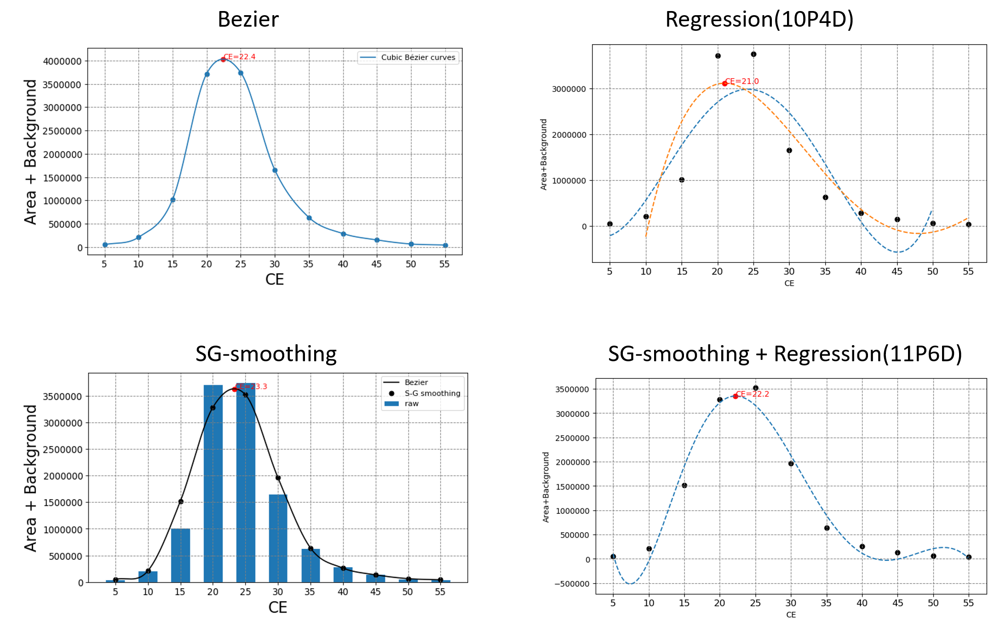

# Streamline MRM's Charges Tuning

In MRM technics, 4 voltages including DP, EP, CE, and CXP should be under setting. The different voltages will lead to different chromatograms that will influence the final results of protein quantification.

- 4 voltages in MRM technics

For obtaining most exact quantity of proteins on our clinical specimens, we need try various voltage values to get the ideal setting of voltages. However, it is time-consuming and costly. As a result, I streamlined the process of finding best voltages from calculating peptide's ( or product's) mass and filtering to final prediction and summarization of best voltages. User can provide a wide range of voltage value and do the prediction to find the best voltage value instead of testing every voltage value on manual.

I provided the following serialized packages to our team members for minimizing their workloads.

1. MRM_methods

    Auto-calculating the output peptide mass is followed by filtering peptides by selected ranges of mass. User can only give their voltage setting by "ramping" or "seperate", and then input files for MRM will generate.

2. Preprocessing_Replicate_Name

    After MRM expirements, we can obtain a output file including "replicate_name" and peptide's signal such as area, background, height etc.. It will provide a function to catogorize data by "replicate_name" for further analysis.

3. Prediction

    I provided 4 methods, including "Bezier curve", "Regression", "SG-smoothing" and "Bezier follows SG-smoothing" to fit the correlation between voltage and quantity, so that the best voltage charge setting should be found.

4. Check

    To understand the accuracy of results from previous predictions, we used validation dataset to estimate the accuracy by prediction-target difference and MSE.

## Demo

- MRM_methods

After Giving a list of request, input files for MRM will generate.

- Prediction

Several prediction methods will be conducted after expirements, and images of fitting will also be ploted.

- Check (estimate the accuracy of prediction)

We can rank these prediction methods by calculating the accuracy of data with known best voltage, so that we can select a prediction method and find the best voltage charge for further protein quantification. 

Taking the CE voltage as example, we found the estemated CE charge is really closed to standard CE charge (R-square is up to 93.5%). As a result, we can use this automatic method to save time on searching best voltage value.

## Launch on BD-Processor

